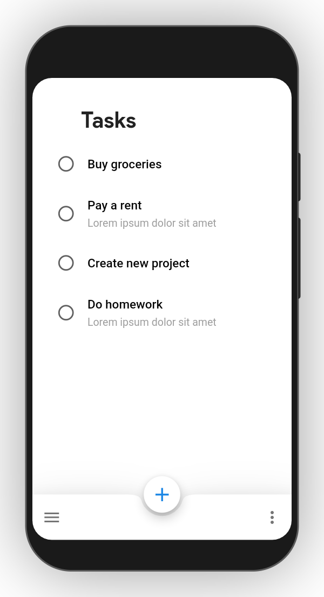
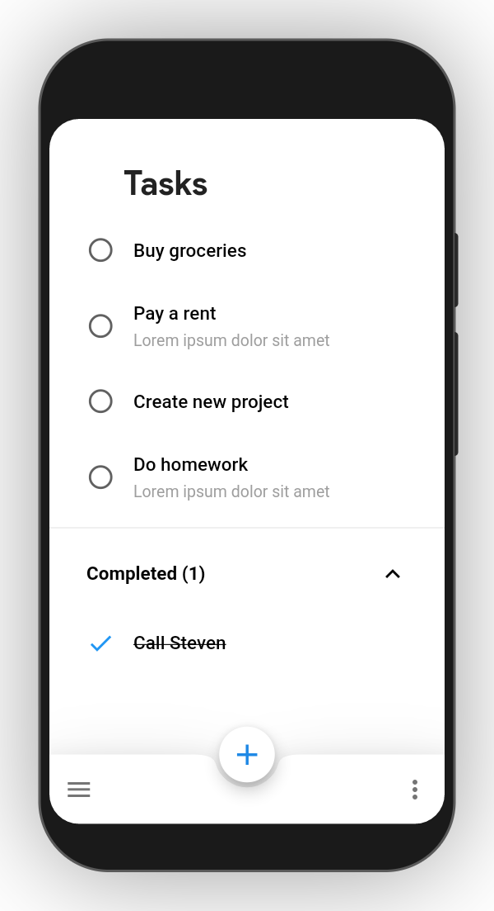
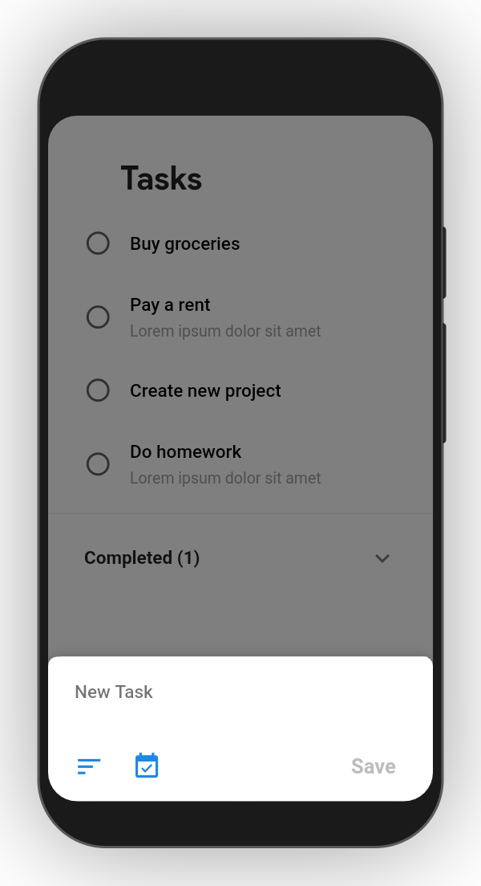
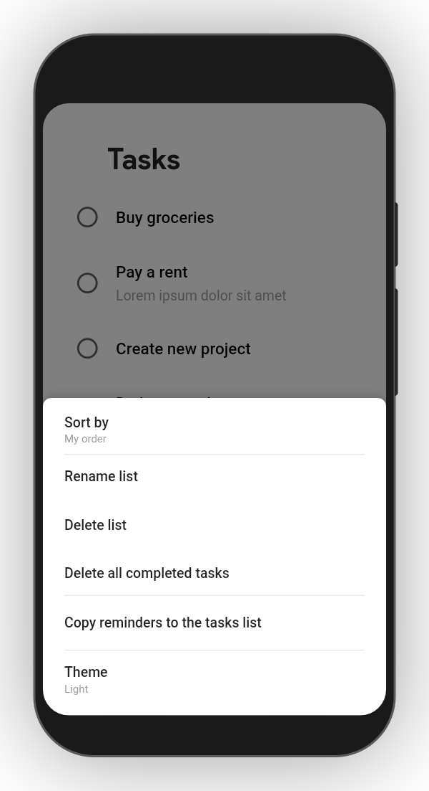
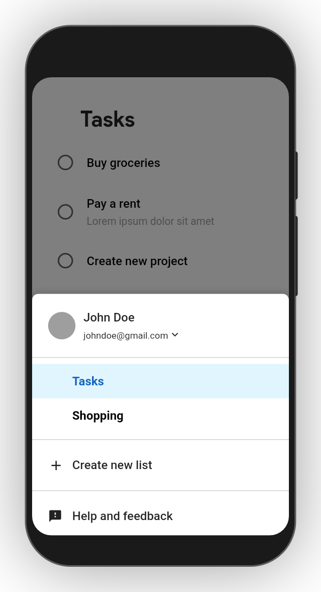
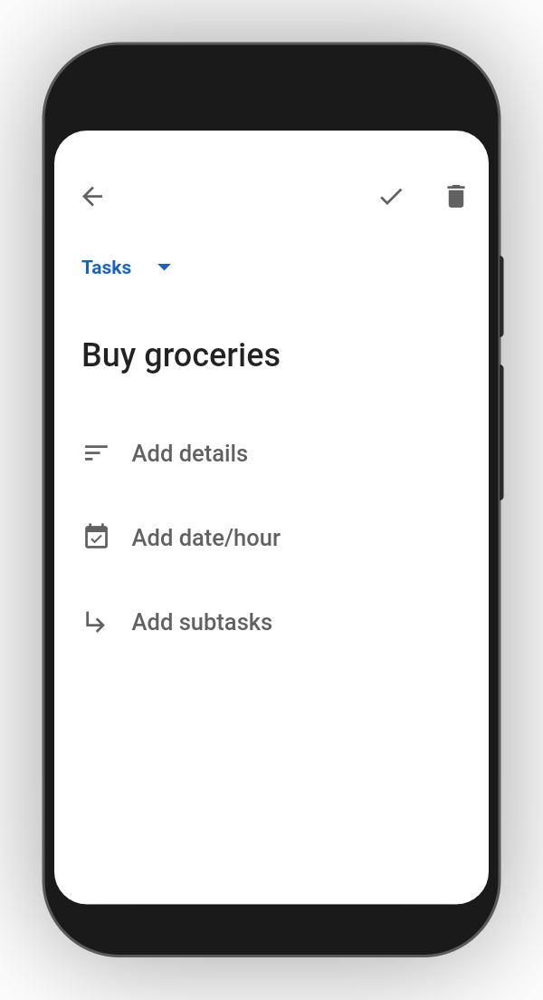

# :beginner: Google Tasks Clone

A clone of the popular task management application written in Flutter

## :book: Table of contents

- [General info](#general-info)
- [Technologies](#technologies)
- [Screenshots](#screenshots)
- [Setup](#setup)

## :pencil: General info

The purpose of this project was to create good working Google Tasks clone and to improve myself at creating mobile apps in Flutter & Dart.

## :gear: Technologies

Project is created with:

- [Flutter](https://flutter.dev/) version: 1.20.0
- [Dart](https://dart.dev/) version: 2.9.0
- [Provider](https://pub.dev/packages/provider) version: 4.3.2+1
- [Localstorage](https://pub.dev/packages/localstorage) version: 3.0.2+5
- [Sliding_up_panel](https://pub.dev/packages/sliding_up_panel) version: 1.0.2
- [Flutter_screenutil](https://pub.dev/packages/flutter_screenutil) version: 3.1.1
- [Device_preview](https://pub.dev/packages/device_preview) version: 0.4.8

## :camera_flash: Screenshots

     

## :computer: Setup

To run this project follow these steps:

1. Clone the repository

```
$ git clone https://github.com/kubacarbon/Google_Tasks_Clone.git
```

2. Open the project

```
$ cd Google_Tasks_Clone
```

3. Install dependencies

```
flutter pub get
```

4. Run app

```
$ flutter run
```
